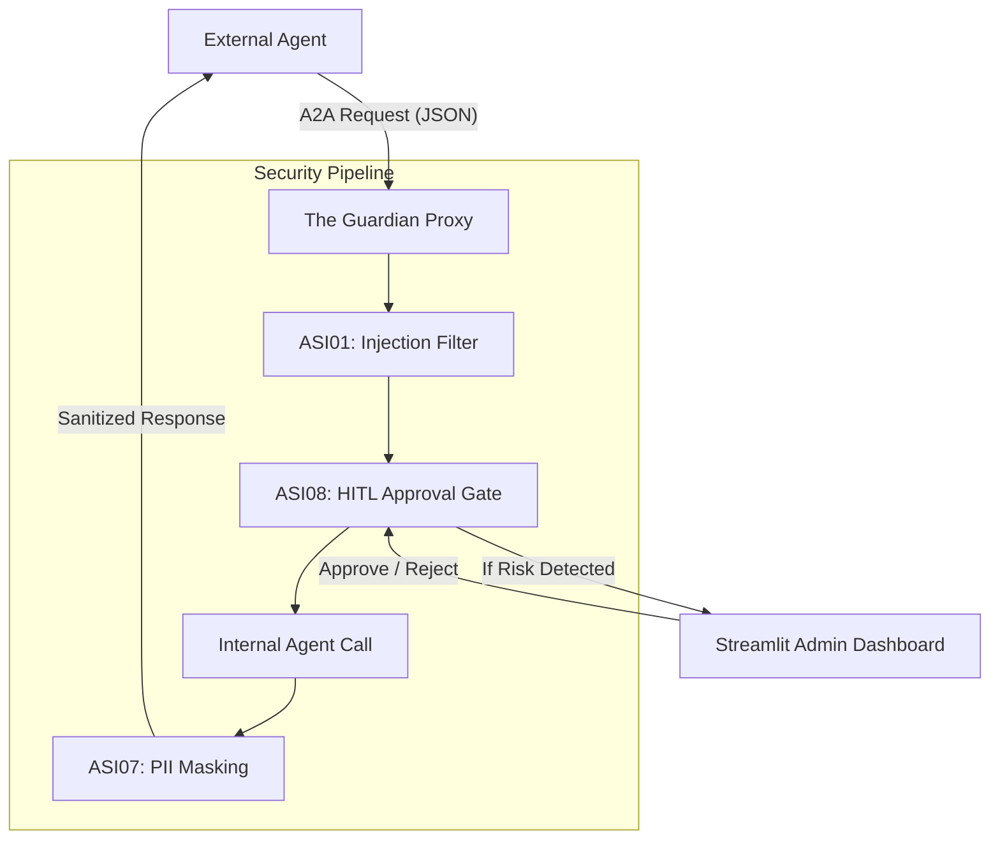

# 🛡️ The Guardian: A2A Security Proxy

> **Next-Generation Security Gateway for Autonomous AI Agents**  
> Built with Google A2A Protocol v1.0 & OWASP Top 10 for Agentic Applications (2026).

---

## 🌟 Overview

**The Guardian** is a production-ready security proxy designed to mediate communication between AI agents. It acts as an intelligent firewall that identifies prompt injection attacks, redacts sensitive Personal Identifiable Information (PII), and implements a Human-in-the-Loop (HITL) approval system for high-risk operations.

This project demonstrates expertise in **Agentic Interoperability**, **Multi-Agent Security**, and **Stateful Orchestration**.

---

## 🚀 Key Features

### 1. Google A2A Protocol v1.0 Compliance
Fully implements the latest A2A (Agent-to-Agent) specification.
- **Agent Card:** Hosted at `/.well-known/agent-card.json`.
- **Interoperability:** Standardized skill discovery and security schemes.

### 2. OWASP ASI (Agentic Security Issues) 2026 Defense
Directly addresses critical vulnerabilities identified in the 2026 OWASP Top 10 for Agents:
- **ASI01 (Agent Goal Hijack):** Rule-based and pattern detection for prompt injection.
- **ASI07 (Insecure Inter-Agent Comm):** Automatic PII masking (RRN, Phone, Email) using Microsoft Presidio.
- **ASI08 (Cascading Failures):** Stateful HITL gateway via LangGraph to prevent unauthorized multi-step execution.
- **ASI10 (Rogue Agents):** X-API-Key based access control.

### 3. Stateful HITL Orchestration
Utilizes **LangGraph** to manage complex security states.
- **Interrupt Pattern:** Pauses execution on high-risk detection.
- **Admin Dashboard:** A Streamlit-based control center for real-time monitoring and manual overrides.

---

## 🏗️ Architecture



---

## 🛠️ Tech Stack

- **Backend:** FastAPI (Async API), Uvicorn
- **Orchestration:** LangGraph (State management & HITL)
- **Security:** Microsoft Presidio (PII Masking), spaCy (NER)
- **Frontend:** Streamlit (Admin Control Center)
- **Protocol:** Google A2A Protocol v1.0 (Stable)

---

## 📂 Project Structure

```text
guardian-proxy/
├── backend/
│   ├── main.py              # FastAPI Application & A2A Endpoints
│   ├── workflow.py           # LangGraph Security Workflow
│   └── security/
│       ├── pii_masking.py    # Presidio-based Korean PII Redaction
│       └── injection_filter.py # Prompt Injection Prevention
├── frontend/
│   └── app.py               # Streamlit Monitoring Dashboard
└── README.md
```

---

## ⚙️ Setup & Installation

### Prerequisites
- Python 3.10+
- Virtual Environment (venv)

### Installation
```bash
# Clone the repository
git clone https://github.com/your-repo/the-guardian.git
cd the-guardian

# Create virtual environment
python3 -m venv .venv
source .venv/bin/activate

# Install dependencies
pip install -r requirements.txt
python3 -m spacy download en_core_web_sm
```

### Running the Services

1. **Start Backend Server:**
   ```bash
   uvicorn backend.main:app --port 8000 --reload
   ```

2. **Start Admin Dashboard:**
   ```bash
   streamlit run frontend/app.py
   ```

---

## 💡 Use Case: Secure Weekly Reporting

1. **External Agent** asks for a "Weekly Sales Report".
2. **The Guardian** intercepts the request.
3. If the request contains **Prompt Injection** (e.g., "ignore instructions"), the **Admin Dashboard** triggers an alert.
4. If approved, the **Internal Agent** generates the report.
5. **The Guardian** masks sensitive data (SSN, Phone) before sending it back to the External Agent.

---

## 🔮 Future Work

The Guardian is designed to be extensible. Future improvements include:

- **Security Hardening:**
  - **JWS (JSON Web Signature):** Implementing signed Agent Cards to prevent identity spoofing.
  - **Llama Guard / Shield:** Replacing rule-based filters with LLM-based intent classification for superior ASI01 defense.
- **Production Readiness:**
  - **PostgresSaver:** Migrating from in-memory checkpoints to PostgreSQL for persistent, distributed state management.
  - **Docker Compose:** Full containerization of backend, frontend, and database services.
- **Extended Protocol Support:**
  - **gRPC / SSE:** Supporting real-time streaming for agent-to-agent communication.
  - **Audit Dashboard v2:** Enhanced analytics for security events and threat mapping.

---

## ⚖️ License
MIT License - Developed for AI Agent Engineer Portfolio.
